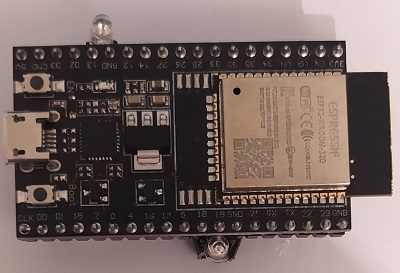

# esp32_microdot

# Проект полезен для изучающих Python и интересующихся направлением IoT.  
  
Цель проекта - веб интерфейс микроконтроллера [ESP32](https://esp32io.com/) позволяющий включать/выключать 2 светодиода.  

  
Веб интерфейс микроконтроллера ESP32 создан на фреймворке [Microdot](https://github.com/miguelgrinberg/microdot?ysclid=lf9wwcnq5g980816931) ([micropython](https://gpiocc.github.io/learn/micropython/esp/2020/04/04/martin-ku-getting-started-with-micropython-for-esp32.html)).  
Microdot - упрощенный аналог фреймворка [Flask](https://medium.com/netron/python-flask-quickstart-2cf258256619).  
веб интерфейс позволяет включать и выключать два светодиода,  
подключенных  к ножкам микроконтроллера  
  
  
Для использования проекта необходимо все файлы кроме папки images скопировать в микроконтроллер ESP32.  
Подключение к ESP32 и перенос файлов можно сделать согласно инструкции https://youtu.be/1efsWgK_QaU ,   
где используется IDE Thony Python.  
инструкция на английском, и это самая лучшая,компактная инструкция на мой взгляд   
[ESP32 Datasheet](https://make.net.za/wp-content/datasheets/Espressif%20ESP32-WROOM-32.pdf)
Первый светодиод подсоединяется на ножки с номером 13 (+) и рядом находящуюся ножку  GND (-), светодиод на 3 вольта, желательно с резистором на 220 ОМ (чего я не сделал), чтобы избежать перегорания ножки микроконтроллера.  
Второй светодиод на ножки с номером 18 (+) и рядом находящийся GND (-), светодиод на 3 вольта, желательно с резистором на 220 ОМ, чтобы избежать перегорания ножки микроконтроллера.  
Интерактивность веб интерфейса создана с помощью [svelte](https://svelte.dev/tutorial/basics)  
  
Через Мобильный телефон подключаемся к вайфай SSID:  Controller-AP,  пароль:  kutbilim,  мобильный интернет должен быть отключен.  
Адрес веб интерфейса http://192.168.4.1:5000  
(контроллер можно настроить на имеющийся вайфай, для это в файле boot.py меняем строки 30-31:  
sta_if_ssid='wifiSSID'  
sta_if_password='wifiPassword')  
  

## ESP32-wroom  

  
## Microdot code  

  
## WEB Interface  

